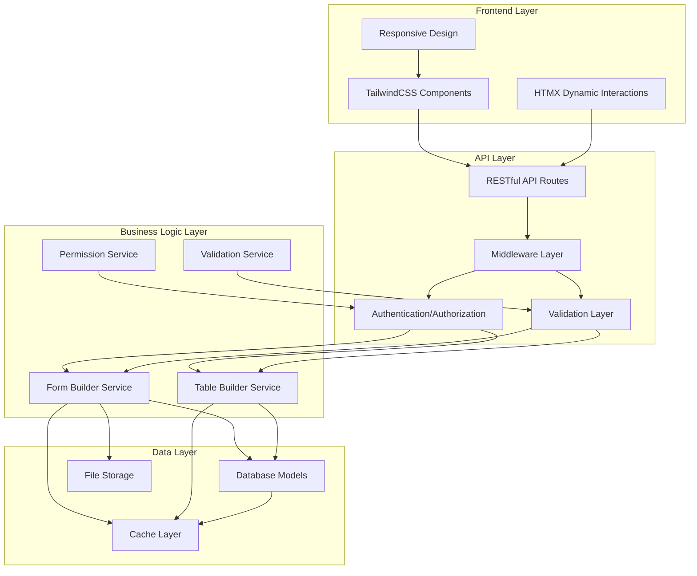

# Design Document

## Overview

本设计文档详细描述了如何将海豚PHP的ZBuilder功能现代化，通过ThinkPHP框架构建RESTful API，结合TailwindCSS和HTMX实现现代化的前端组件系统。设计遵循RESTful原则，采用模块化架构，确保系统的可扩展性和维护性。

## Architecture

### 系统架构图



### 技术栈选择

**后端技术栈:**
- ThinkPHP 8.x - 现代PHP框架，支持PSR标准
- PHP 8.1+ - 最新PHP版本，支持强类型和现代化特性
- MySQL/PostgreSQL/SQLite - 支持多种数据库，默认使用SQLite（无需安装）
- Redis - 缓存和会话存储（可选）
- JWT - 无状态身份验证

**前端技术栈:**
- TailwindCSS 3.x - 实用优先的CSS框架
- HTMX - 简化AJAX交互的JavaScript库
- Alpine.js - 轻量级JavaScript框架（用于复杂交互）
- Heroicons - SVG图标库

## Components and Interfaces

### API接口设计

#### 表单构建器API

```php
// 表单配置获取接口
GET /api/forms/{formId}/config
Response: {
    "form_id": "user_registration",
    "title": "用户注册",
    "method": "POST",
    "action": "/api/users",
    "fields": [
        {
            "type": "text",
            "name": "username",
            "label": "用户名",
            "placeholder": "请输入用户名",
            "required": true,
            "validation": {
                "rules": "required|min:3|max:20",
                "messages": {
                    "required": "用户名不能为空",
                    "min": "用户名至少3个字符"
                }
            },
            "attributes": {
                "class": "form-input",
                "data-validate": "realtime"
            }
        }
    ],
    "groups": [
        {
            "title": "基本信息",
            "fields": ["username", "email"]
        }
    ],
    "buttons": [
        {
            "type": "submit",
            "text": "提交",
            "class": "btn-primary"
        }
    ]
}

// 表单提交接口
POST /api/forms/{formId}/submit
Request: {
    "username": "testuser",
    "email": "test@example.com"
}
Response: {
    "success": true,
    "message": "表单提交成功",
    "data": {
        "id": 123,
        "username": "testuser"
    }
}
```

#### 数据表格API

```php
// 表格数据获取接口
GET /api/tables/{tableId}/data?page=1&limit=20&sort=created_at&order=desc&filter[status]=active
Response: {
    "table_id": "user_list",
    "columns": [
        {
            "field": "id",
            "title": "ID",
            "sortable": true,
            "width": 80
        },
        {
            "field": "username",
            "title": "用户名",
            "sortable": true,
            "editable": true
        }
    ],
    "data": [
        {
            "id": 1,
            "username": "admin",
            "created_at": "2024-01-01 10:00:00"
        }
    ],
    "pagination": {
        "total": 100,
        "per_page": 20,
        "current_page": 1,
        "last_page": 5
    },
    "actions": [
        {
            "name": "edit",
            "icon": "pencil",
            "class": "text-blue-500"
        },
        {
            "name": "delete",
            "icon": "trash",
            "class": "text-red-500"
        }
    ]
}

// 行内编辑接口
PUT /api/tables/{tableId}/rows/{rowId}
Request: {
    "field": "username",
    "value": "newusername"
}
Response: {
    "success": true,
    "message": "更新成功"
}
```

### 前端组件架构

#### 组件结构

```
components/
├── form/
│   ├── FormBuilder.php          # 表单构建器主类
│   ├── fields/
│   │   ├── TextField.php        # 文本输入字段
│   │   ├── SelectField.php      # 下拉选择字段
│   │   ├── CheckboxField.php    # 复选框字段
│   │   ├── RadioField.php       # 单选按钮字段
│   │   ├── FileField.php        # 文件上传字段
│   │   └── EditorField.php      # 富文本编辑器字段
│   └── groups/
│       ├── FieldGroup.php       # 字段分组
│       └── FormTabs.php         # 表单标签页
├── table/
│   ├── TableBuilder.php         # 表格构建器主类
│   ├── columns/
│   │   ├── TextColumn.php       # 文本列
│   │   ├── NumberColumn.php     # 数字列
│   │   ├── DateColumn.php       # 日期列
│   │   └── ActionColumn.php     # 操作列
│   └── features/
│       ├── Pagination.php         # 分页组件
│       ├── Sorting.php           # 排序功能
│       ├── Filtering.php         # 筛选功能
│       └── Search.php            # 搜索功能
└── common/
    ├── Button.php                # 按钮组件
    ├── Modal.php                 # 模态框组件
    ├── Alert.php                 # 警告提示组件
    └── Loading.php               # 加载状态组件
```

#### 组件渲染流程

```php
// 表单组件渲染示例
class FormBuilder {
    private $fields = [];
    private $config = [];
    
    public function addField($type, $name, $config) {
        $fieldClass = $this->getFieldClass($type);
        $this->fields[$name] = new $fieldClass($name, $config);
        return $this;
    }
    
    public function render() {
        $html = '<form class="space-y-6" hx-post="' . $this->config['action'] . '" hx-target="#form-result">';
        
        foreach ($this->fields as $field) {
            $html .= $field->render();
        }
        
        $html .= '<div class="flex justify-end space-x-3">';
        $html .= '<button type="submit" class="btn-primary">提交</button>';
        $html .= '</div>';
        $html .= '</form>';
        
        return $html;
    }
}
```

## Data Models

### 核心数据模型

```php
// 表单模型
namespace app\model;

use think\Model;

class Form extends Model
{
    protected $name = 'forms';
    
    protected $schema = [
        'id' => 'int',
        'form_id' => 'string',     // 表单标识符
        'title' => 'string',        // 表单标题
        'config' => 'json',         // 表单配置
        'fields' => 'json',         // 字段定义
        'created_at' => 'datetime',
        'updated_at' => 'datetime'
    ];
    
    // 关联字段
    public function fields()
    {
        return $this->hasMany(FormField::class, 'form_id', 'id');
    }
}

// 表单字段模型
class FormField extends Model
{
    protected $name = 'form_fields';
    
    protected $schema = [
        'id' => 'int',
        'form_id' => 'int',
        'field_name' => 'string',
        'field_type' => 'string',
        'field_config' => 'json',
        'validation_rules' => 'json',
        'sort_order' => 'int'
    ];
}

// 数据表格模型
class DataTable extends Model
{
    protected $name = 'data_tables';
    
    protected $schema = [
        'id' => 'int',
        'table_id' => 'string',
        'title' => 'string',
        'data_source' => 'string',  // 数据源类型：model, sql, api
        'source_config' => 'json',  // 数据源配置
        'columns' => 'json',        // 列定义
        'filters' => 'json',        // 筛选配置
        'actions' => 'json',        // 操作按钮配置
        'permissions' => 'json'     // 权限配置
    ];
}
```

### 缓存策略

```php
// 配置缓存
class ConfigCache
{
    private $redis;
    private $ttl = 3600; // 1小时缓存
    
    public function getFormConfig($formId)
    {
        $key = "form:config:{$formId}";
        $config = $this->redis->get($key);
        
        if (!$config) {
            $config = Form::where('form_id', $formId)->find();
            $this->redis->setex($key, $this->ttl, json_encode($config));
        }
        
        return json_decode($config, true);
    }
    
    public function invalidateFormConfig($formId)
    {
        $key = "form:config:{$formId}";
        $this->redis->del($key);
    }
}
```

## Error Handling

### 错误处理架构

```php
// 自定义异常类
namespace app\exception;

use think\Exception;
use think\exception\Handle;

class ApiException extends Exception
{
    protected $code = 400;
    protected $message = 'API错误';
    protected $data = [];
    
    public function __construct($message = '', $code = 400, $data = [])
    {
        parent::__construct($message, $code);
        $this->data = $data;
    }
    
    public function getData()
    {
        return $this->data;
    }
}

// 异常处理类
class ExceptionHandler extends Handle
{
    public function render($request, Throwable $e): Response
    {
        if ($e instanceof ApiException) {
            return json([
                'success' => false,
                'message' => $e->getMessage(),
                'code' => $e->getCode(),
                'data' => $e->getData()
            ], 200);
        }
        
        // 其他异常处理
        return parent::render($request, $e);
    }
}
```

### 错误码定义

```php
// 错误码常量定义
namespace app\constants;

class ErrorCode
{
    const SUCCESS = 200;
    const VALIDATION_ERROR = 40001;
    const AUTHENTICATION_ERROR = 40101;
    const AUTHORIZATION_ERROR = 40301;
    const NOT_FOUND_ERROR = 40401;
    const SERVER_ERROR = 50001;
    
    const FORM_NOT_FOUND = 41001;
    const FIELD_VALIDATION_ERROR = 41002;
    const TABLE_NOT_FOUND = 42001;
    const DATA_SOURCE_ERROR = 42002;
}
```

## Testing Strategy

### 测试架构

```php
// API测试基类
namespace tests;

use think\testing\TestCase;

class ApiTestCase extends TestCase
{
    protected $baseUrl = 'http://localhost';
    protected $headers = [
        'Accept' => 'application/json',
        'Content-Type' => 'application/json'
    ];
    
    protected function setUp(): void
    {
        parent::setUp();
        // 测试环境初始化
    }
    
    protected function apiRequest($method, $uri, $data = [])
    {
        return $this->json($method, $uri, $data, $this->headers);
    }
    
    protected function assertApiSuccess($response)
    {
        $response->assertStatus(200)
                 ->assertJsonStructure([
                     'success',
                     'message',
                     'data'
                 ])
                 ->assertJson([
                     'success' => true
                 ]);
    }
}

// 表单构建器测试
class FormBuilderTest extends ApiTestCase
{
    public function testGetFormConfig()
    {
        $response = $this->apiRequest('GET', '/api/forms/test-form/config');
        
        $this->assertApiSuccess($response);
        $response->assertJsonStructure([
            'data' => [
                'form_id',
                'title',
                'fields' => [
                    '*' => [
                        'type',
                        'name',
                        'label',
                        'validation'
                    ]
                ]
            ]
        ]);
    }
    
    public function testSubmitForm()
    {
        $formData = [
            'username' => 'testuser',
            'email' => 'test@example.com'
        ];
        
        $response = $this->apiRequest('POST', '/api/forms/test-form/submit', $formData);
        
        $this->assertApiSuccess($response);
        $response->assertJson([
            'message' => '表单提交成功'
        ]);
    }
}
```

### 前端组件测试

```javascript
// HTMX组件测试
function testFormSubmission() {
    const form = document.querySelector('#test-form');
    const submitBtn = form.querySelector('[type="submit"]');
    
    // 模拟表单提交
    htmx.trigger(form, 'submit');
    
    // 验证HTMX请求
    document.addEventListener('htmx:afterRequest', (event) => {
        if (event.detail.elt === form) {
            assert.equal(event.detail.successful, true);
            assert.equal(event.detail.response.status, 200);
        }
    });
}

// TailwindCSS响应式测试
function testResponsiveDesign() {
    const breakpoints = {
        mobile: 375,
        tablet: 768,
        desktop: 1024
    };
    
    Object.entries(breakpoints).forEach(([device, width]) => {
        // 设置视口大小
        window.resizeTo(width, 800);
        
        // 验证组件在不同屏幕尺寸下的表现
        const formContainer = document.querySelector('.form-container');
        const computedStyle = window.getComputedStyle(formContainer);
        
        if (device === 'mobile') {
            assert.equal(computedStyle.padding, '16px');
        } else if (device === 'desktop') {
            assert.equal(computedStyle.padding, '24px');
        }
    });
}
```

## 性能优化策略

### 数据库优化

```php
// 查询优化
class OptimizedTableService
{
    public function getTableData($tableId, $page = 1, $limit = 20)
    {
        return DataTable::where('table_id', $tableId)
            ->with(['columns', 'filters']) // 预加载关联数据
            ->cache(true, 300) // 5分钟缓存
            ->paginate($limit, false, ['page' => $page]);
    }
}
```

### 前端性能优化

```html
<!-- HTMX优化配置 -->
<div id="table-container"
     hx-get="/api/tables/user-list/data"
     hx-trigger="load"
     hx-target="#table-content"
     hx-indicator="#loading-spinner"
     hx-push-url="true">
    
    <!-- 骨架屏加载 -->
    <div id="loading-spinner" class="htmx-indicator">
        <div class="animate-pulse">
            <div class="h-4 bg-gray-200 rounded w-3/4 mb-2"></div>
            <div class="h-4 bg-gray-200 rounded w-1/2"></div>
        </div>
    </div>
    
    <!-- 实际内容容器 -->
    <div id="table-content"></div>
</div>
```

## 部署和运维

### Docker容器化

```dockerfile
# Dockerfile
FROM php:8.1-fpm

# 安装系统依赖
RUN apt-get update && apt-get install -y \
    git \
    curl \
    libpng-dev \
    libonig-dev \
    libxml2-dev \
    zip \
    unzip

# 安装PHP扩展
RUN docker-php-ext-install pdo_mysql mbstring exif pcntl bcmath gd

# 安装Composer
COPY --from=composer:latest /usr/bin/composer /usr/bin/composer

# 设置工作目录
WORKDIR /var/www

# 复制项目文件
COPY . .

# 安装依赖
RUN composer install --no-dev --optimize-autoloader

# 设置权限
RUN chown -R www-data:www-data /var/www

EXPOSE 9000
CMD ["php-fpm"]
```

### 监控和日志

```php
// 性能监控
class PerformanceMonitor
{
    private $startTime;
    private $startMemory;
    
    public function startMonitoring()
    {
        $this->startTime = microtime(true);
        $this->startMemory = memory_get_usage();
    }
    
    public function logPerformance($operation)
    {
        $endTime = microtime(true);
        $endMemory = memory_get_usage();
        
        $duration = $endTime - $this->startTime;
        $memoryUsage = $endMemory - $this->startMemory;
        
        Log::info('Performance Metrics', [
            'operation' => $operation,
            'duration' => $duration,
            'memory_usage' => $memoryUsage,
            'peak_memory' => memory_get_peak_usage()
        ]);
    }
}
```

## 安全考虑

### API安全

```php
// 速率限制中间件
namespace app\middleware;

use think\facade\Cache;

class RateLimit
{
    public function handle($request, \Closure $next)
    {
        $key = 'api_rate_limit:' . $request->ip();
        $attempts = Cache::get($key, 0);
        
        if ($attempts >= 100) { // 每小时最多100次请求
            return json([
                'success' => false,
                'message' => '请求过于频繁，请稍后再试'
            ], 429);
        }
        
        Cache::inc($key);
        Cache::expire($key, 3600);
        
        return $next($request);
    }
}
```

### 输入验证

```php
// 强化验证规则
namespace app\validate;

use think\Validate;

class FormDataValidate extends Validate
{
    protected $rule = [
        'username' => 'require|alphaNum|length:3,20|unique:users',
        'email' => 'require|email|unique:users',
        'password' => 'require|length:6,20|regex:/^[a-zA-Z0-9_]+$/',
        'phone' => 'mobile',
        'id_card' => 'idCard',
        'bank_card' => 'bankCard'
    ];
    
    protected $message = [
        'username.require' => '用户名不能为空',
        'username.alphaNum' => '用户名只能包含字母和数字',
        'username.length' => '用户名长度必须在3-20位之间',
        'username.unique' => '用户名已存在',
        'email.require' => '邮箱不能为空',
        'email.email' => '邮箱格式不正确',
        'password.regex' => '密码只能包含字母、数字和下划线'
    ];
}
```

这个设计文档提供了完整的架构设计，包括API接口、组件结构、数据模型、错误处理、测试策略、性能优化、部署运维和安全考虑。设计遵循现代化的开发原则，确保系统的可扩展性、可维护性和高性能。